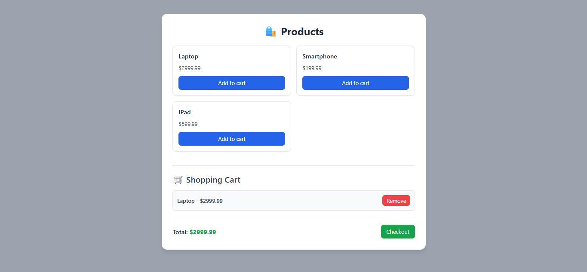

# 🛍️ E-Commerce Website

A modern and responsive **E-Commerce web app** built with **HTML, CSS, and JavaScript**.  
It features product listings, shopping cart functionality, and a smooth user experience for online shoppers.

---

## 🚀 Features
- 🛒 Add / Remove items from cart  
- 💰 Dynamic total price calculation  
- 📱 Fully responsive UI  
- 🔍 Product listing with clean layout  
- ⚡ Interactive JavaScript-based functionality  

---

## ⚙️ How to Use
1. Open the project folder.  
2. Launch `index.html` in your browser.  
3. Browse products, add them to the cart, and view the total.

---

## 🧠 Tech Stack
HTML • CSS • JavaScript  

---

## 📸 Preview

---

## 📜 License
MIT License © 2025
